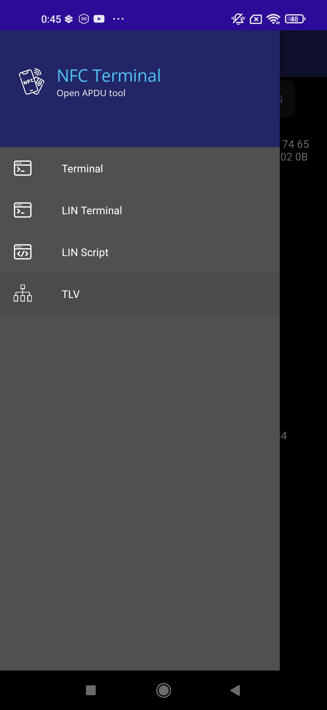
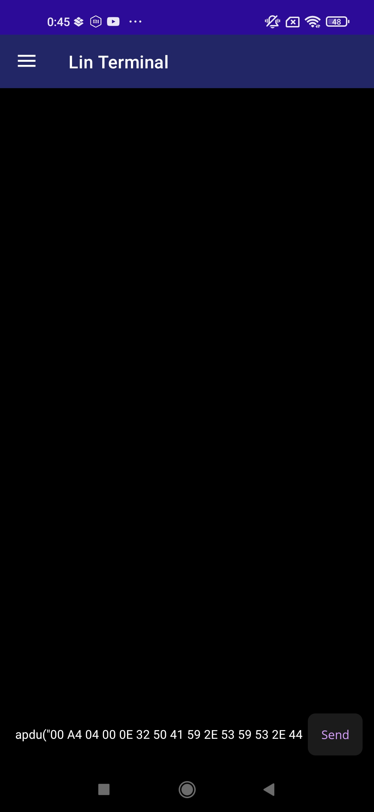

# Getting Started - examle on EMV expired card

The app starts on the Terminal page. Here, you can send raw APDU commands in hex. \
 \
The default command in the field (00 A4 04 00 0E 31 50 41 59 2E 53 59 53 2E 44 44 46 30 31 00) is a SELECT by Name command for '2PAY.SYS.DDF01'. \
 \
When the card is detected, a green message notifies you about it. \
 \
After placing the card near the phone and keeping it there until the notification appears, you can send a command. The response includes two parts: the SW (Status Word) and the Data, both in hexadecimal format. The SW indicates the response status from the card. For example, in this case, a value of 90XX means that the selected file exists and was successfully selected. \
 \
You can use a single tap gesture on the message in the Terminal to see possible options. \
 \
Command messages and responses have different options. In the response, you can additionally copy only a part of the data or try to parse the response data as a TLV tree. \
 \
If you choose to parse the TLV, the app automatically navigates to this page and shows the result (if the data is valid). From here, you can modify the input, copy the output from the field below, or use one of the two buttons: 'Copy Tree', which copies the tree as displayed in the box below, or 'Copy JSON', which copies the tree in JSON format. \
 \
If the given hex data fails during tree parsing, you'll see an error message instead of the tree. The message will try to explain what might be wrong. \
 \
Using the snackbar, you can navigate through all four pages. \
 \
Let's navigate to the LIN Terminal. From here, you can also communicate with the card using the scripting language 'LIN' ([see LIN](https://github.com/Luki128/Lin-language/blob/main/README.md)) in the interactive console. \
 \
Here, you get the same default command, but written in LIN. Messages about card detection also appear here. \
 \
Card detection works the same on all three pages. There's no specific disconnect message — but if the card is out of range or communication is interrupted, you'll see a message when you try to send something to the card \
 \
Let's move to the LIN Script page. Here, you can develop multi-line scripts using the LIN language. A new error message might appear, as shown below. This usually means the card isn’t connected — or that it was never connected during the current session. Later, you may see a standard error instead. \

 \
The code file includes an example LIN script. This script tries to read log files from an EMV card and display the transaction date and value. The script ends with an error, but that's expected because not all log files may exist or the card may not grant access to them. \
You can modify the script, re-run it, and have fun! (P.S. There's a function to highlight the line where the error occurred, but it's not fully implemented yet—so don't rely on it too much.)

